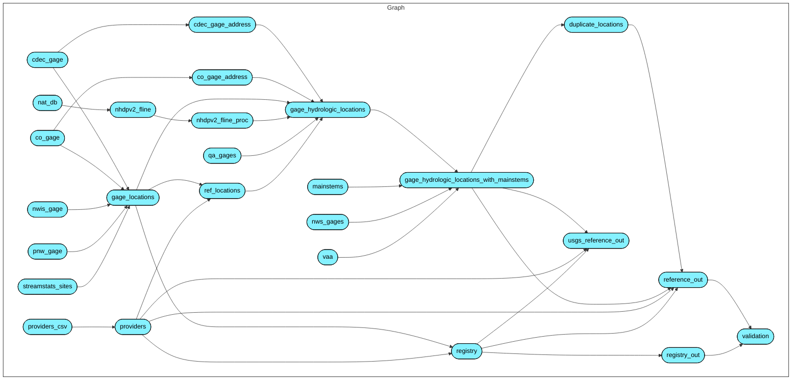

# Reference stream gages for geoconnex.us

This repository houses workflow software for compilation of community reference stream gages. The output of this workflow will generate Persistent Identifiers for the [geoconnex.us system](https://github.com/internetofwater/geoconnex.us), reference landing page content for the [reference.geoconnex.us system](https://reference.geoconnex.us/), and a set of best available network locations for the [Network Linked Data Index](https://labs.waterdata.usgs.gov/about-nldi/index.html).

These reference locations are intended to be a shared community resource that anyone can contribute to. If a reference location does not exist and data are collected there, the location can and should be contributed such that others can reference the location.

Workflow:

The diagram below illustrates the overall workflow implemented in this repository.

The workflow exists in four phases. 

1. load data and update registry
1. establish unique and reference spatial locations
1. establish hydrologic locations
1. write reference output

Unique logic is introduced for each provider in some cases.

# Architecture

This project exists in a linked data architecture that relies on Web uniform resource identifiers (URIs) for both digital and real world entities. There are three types of resources in the architecture:
1. Real-world monitoring locations identified by a so-called "non-information URI".
1. Information about the real world monitoring locations identified by a URL that is the target of a redirect from a non-information URI.
1. A particular organization's information available for the real world monitoring location.

In practice, these urls will look like: 
1. `https://geoconnex.us/ref/gages/1071321` (which will redirect to 2)
1. `https://reference.geoconnex.us/collections/gages/items/1071321` (which will provide information about the reference location, including a link to 3)
1. `https://waterdata.usgs.gov/monitoring-location/02469600` (which is the USGS's site information for this particular reference location.)

It is important to maintain this separation because no one organization, other than a community organization set up to fulfill this role, can be expected to be both the community reference catalog and a provider of their own information.  

# Project structure

- `/R` functions defined for this project.
- `/data` data downloaded for this project.
- `/temp` temporary output that may be of interest for debugging.
- `/out` output to be contributed elsewhere. 
- `/reg` registry of gages tracked in source control.
- `/docs` contains artifacts to be served via github.io

# Contributing

First, thank you for considering a contribution! For this to work, everyone with unique monitoring locations need to be willing to contribute those locations here. 

This is a new project and, as such, exactly how contributions are made will be flexible and a work in progress. If you have locations to add, just reach out [in the issues](https://github.com/internetofwater/ref_gages/issues) and/or submit a pull request. The maintainer(s) are more than happy to coordinate and do whatever legwork is needed to get new reference locations into the registry.

As time goes on and the nature of contributions becomes more clear, this guidance will become more specific, but until then, just get in touch and we'll work together.

## Disclaimer

This information is preliminary or provisional and is subject to revision. It is being provided to meet the need for timely best science. The information has not received final approval by the U.S. Geological Survey (USGS) and is provided on the condition that neither the USGS nor the U.S. Government shall be held liable for any damages resulting from the authorized or unauthorized use of the information.

This software is in the public domain because it contains materials that originally came from the U.S. Geological Survey  (USGS), an agency of the United States Department of Interior. For more information, see the official USGS copyright policy at [https://www.usgs.gov/visual-id/credit_usgs.html#copyright](https://www.usgs.gov/visual-id/credit_usgs.html#copyright)

Although this software program has been used by the USGS, no warranty, expressed or implied, is made by the USGS or the U.S. Government as to the accuracy and functioning of the program and related program material nor shall the fact of distribution constitute any such warranty, and no responsibility is assumed by the USGS in connection therewith.

This software is provided "AS IS."

 
